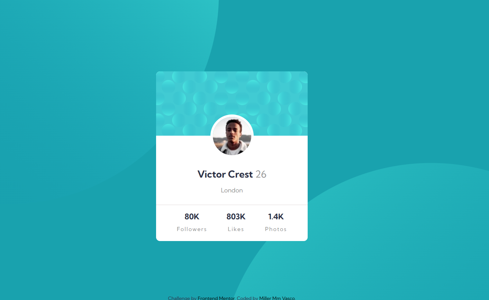

# frontendMentor-profile-card-component_Challenge
# Desafio Frontend Mentor - Profile Card Component

Este repositório contém a solução para o desafio do site Frontend Mentor, o Profile Card Component. O desafio consiste em criar um componente de perfil em forma de card, utilizando HTML e CSS.

## Visão Geral do Desafio

O desafio consiste em replicar um componente de perfil em forma de card, que exiba informações básicas sobre uma pessoa, como nome, cargo e redes sociais. O layout do card foi fornecido pelo Frontend Mentor, e o objetivo é criar uma versão fiel utilizando HTML e CSS.

## Preview do Desafio Concluído

Você pode conferir a versão final do desafio hospedada [aqui](https://xx-mill3r-xx.github.io/frontendMentor-profile-card-component_Challenge/).

## Tecnologias Utilizadas

- HTML5
- CSS3

## Aprendizados e Desafios

Durante a resolução deste desafio, pude praticar a estruturação do HTML e a estilização do componente utilizando CSS. Aprendi a criar um layout responsivo, utilizar técnicas de posicionamento e estilização para obter o resultado desejado.

Um dos desafios que enfrentei foi garantir que o layout do componente ficasse fiel ao design fornecido, mantendo a responsividade e uma boa aparência em diferentes tamanhos de tela. Também trabalhei para tornar o código limpo, organizado e seguindo as melhores práticas de desenvolvimento web.

## Contribuição

Contribuições não são aceitas neste repositório, pois se trata de uma solução individual para um desafio específico. No entanto, sinta-se à vontade para explorar o código, fazer fork do repositório e adaptá-lo de acordo com suas necessidades.
